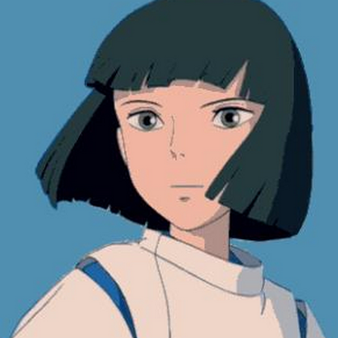

<!-- PROJECT LOGO -->
<br />
<p align="center">
  <a href="https://github.com/Pexilo">
    
  </a>

  <h3 align="center">SoT Reader</h3>

  <p align="center">
	A tool for people who want to save time when writing down the lore of Sea of Thieves!<br />
    <a href="https://github.com/roshanlam/ReadMeTemplate/"><strong>Explore the docs »</strong></a>
    <br />
    <br />
    <a href="https://github.com/roshanlam/ReadMeTemplate/">View Demo</a>
    ·
    <a href="https://github.com/roshanlam/ReadMeTemplate/issues">Report Bug</a>
    ·
    <a href="https://github.com/roshanlam/ReadMeTemplate/issues">Request Feature</a>
  </p>
</p>

<!-- ABOUT THE PROJECT -->
## About The Project

I noticed that a lot of people who document the Sea of Thieves lore were writing down the text of the books by hand, so I created this script to allow you to automate this by taking screenshots.

Important notes:
* The script use CPU to detect text, speed may differ from a system to another
* Don't run the same images multiple times if you find mistakes, the results will be the same just correct them by hand
* What I've tested: dont work with Rose/Gold Hoarders/Larinna police, <a href="https://i.imgur.com/hxr7BRB.jpeg">see this image</a>
* All lore books and dialogue works correctly make sure you don't have any text on your screenshots like island popup or players names

There is an end of execution beep once the script has finished running, this allows you to do something else.

<!-- GETTING STARTED -->
## Getting Started

This is an example of how you may give instructions on setting up your project locally.
To get a local copy up and running follow these simple example steps.

### Prerequisites

This is an example of how to list things you need to use the software and how to install them.
* npm
```sh
npm install npm@latest -g
```

### Installation

1. Get a free API Key at [https://example.com](https://example.com)
2. Clone the repo
```sh
git clone https://github.com/your_username_/Project-Name.git
```
3. Install NPM packages
```sh
npm install
```
4. Enter your API in `config.js`
```JS
const API_KEY = 'ENTER YOUR API';
```


<!-- USAGE EXAMPLES -->
## Usage

Use this space to show useful examples of how a project can be used. Additional screenshots, code examples and demos work well in this space. You may also link to more resources.

_For more examples, please refer to the [Documentation](https://example.com)_


<!-- ROADMAP -->
## 🚧 Roadmap

See the [open issues](https://github.com/roshanlam/ReadMeTemplate/issues) for a list of proposed features (and known issues).


<!-- CONTRIBUTING -->
## 🤝 Contributing

Contributions are what make the open source community such an amazing place to be learn, inspire, and create. Any contributions you make are **extremely appreciated**.

1. Fork the Project
2. Create your Feature Branch (`git checkout -b feature/AmazingFeature`)
3. Commit your Changes (`git commit -m 'Add some AmazingFeature'`)
4. Push to the Branch (`git push origin feature/AmazingFeature`)
5. Open a Pull Request


<!-- LICENSE -->
## 📝 License
Describe your License for your project. 

Distributed under the MIT License. See `LICENSE` for more information.


<!-- CONTACT -->
## 📫 Contact

Your Name - [@your_twitter](https://twitter.com/your_username) - email@example.com

Project Link: [https://github.com/your_username/repo_name](https://github.com/your_username/repo_name)


<!-- ACKNOWLEDGEMENTS -->
## Acknowledgements
* [Img Shields](https://shields.io)
* [GitHub Pages](https://pages.github.com)
* [Font Awesome](https://fontawesome.com)
* blah blah blah....


<!-- MARKDOWN LINKS & IMAGES -->
<!-- https://www.markdownguide.org/basic-syntax/#reference-style-links -->
[forks-shield]: https://img.shields.io/github/forks/roshanlam/ReadMeTemplate?style=for-the-badge
[forks-url]: https://github.com/roshanlam/ReadMeTemplate/network/members
[stars-shield]: https://img.shields.io/github/stars/roshanlam/ReadMeTemplate?style=for-the-badge
[stars-url]: https://github.com/roshanlam/ReadMeTemplate/stargazers
[issues-shield]: https://img.shields.io/github/issues/roshanlam/ReadMeTemplate?style=for-the-badge
[issues-url]: https://github.com/roshanlam/ReadMeTemplate/issues
[linkedin-shield]: https://img.shields.io/badge/-LinkedIn-black.svg?style=flat-square&logo=linkedin&colorB=555
[linkedin-url]: https://linkedin.com/in/roshan-lamichhane
